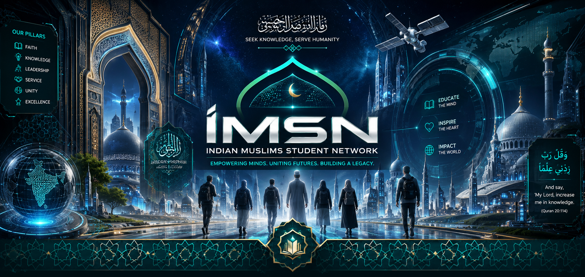

  <!-- 👉 REPLACE THE src BELOW WITH YOUR IMAGE URL -->
  

<h1 align="center">IMSN — Indian Muslims Student Network</h1>

  <em>A community-driven hub for Indian Muslim students to connect, support one another, and grow — 
  academically, professionally, and spiritually.</em>

  <strong>بِسْمِ اللهِ الرَّحْمٰنِ الرَّحِيْمِ</strong> 
  <em>“Read! In the name of your Lord who created.”</em> — Surah Al-'Alaq (96:1)

  <em>“My Lord, increase me in knowledge.”</em> — Surah Taha (20:114)

---

This repository is not a finished product. It is an open invitation — a first stone laid in the foundation of something meaningful, to be built together, with sincerity and with patience.

> *"Whoever travels a path in search of knowledge, Allah will make easy for him a path to Paradise."*
> — Prophet Muhammad ﷺ (Sahih Muslim)

---

## 📖 Table of Contents

1. [About IMSN](#1-about-imsn)
2. [Why Join?](#2-why-join)
3. [What This Could Become](#3-what-this-could-become)
4. [Current Status](#4-current-status)
5. [An Open, Community-Built Effort](#5-an-open-community-built-effort)
6. [How to Get Involved](#6-how-to-get-involved)
7. [Discussion Topics to Start With](#7-discussion-topics-to-start-with)
8. [Guiding Principles](#8-guiding-principles)
9. [Roadmap](#9-roadmap)
10. [Maintainers](#10-maintainers)
11. [License](#11-license)
12. [Contact](#12-contact)

---

## 1. About IMSN

**IMSN (Indian Muslims Student Network)** is an open, grassroots initiative to build a lasting network for Indian Muslim students — across schools, colleges, universities, and countries — so that they may find community, mentorship, resources, and opportunities that are too often difficult to attain alone.

The pursuit of knowledge (*'ilm*) holds an honoured place in our tradition. Yet many Indian Muslim students walk their academic and professional paths without a support system shaped around their particular needs — whether that means discovering scholarships, holding on to one's identity in unfamiliar spaces, receiving career guidance from those who truly understand the journey, or simply finding others who understand without needing to be told.

IMSN exists to close that gap — by building an open, transparent, and community-owned platform, beginning here, in this repository. We regard this work not merely as a project, but as a service to the *ummah* and an act of worship when done with the right intention.

---

## 2. Why Join?

If you are an Indian Muslim student — or an ally who wishes to help build this — consider why this is worthy of your time:

- 🤝 **You will not walk this path alone.** From choosing the right college to securing your first position, there is immense value in learning from those who have walked a similar road. The Prophet ﷺ described the believers as one body — when one part aches, the whole body responds.
- 🎓 **Access to opportunities that do not always reach everyone.** Scholarships, fellowships, internships, and mentorship programmes frequently pass unnoticed, simply because information fails to reach those who need it. We intend to correct that.
- 🕌 **A space that understands your context.** Balancing faith, identity, academics, and ambition is a journey of its own. This network is built by, and for, people who understand that balance intimately.
- 🌍 **A growing network, not a static resource.** As more students and alumni join, the value compounds — more mentors, more referrals, more shared experience, more doors opened.
- 🛠️ **A chance to shape something from the very beginning.** This is not a polished application with a fixed vision. It is early, it is open, and your ideas can genuinely determine its direction.
- 📢 **Representation and visibility.** A public, active network signals that this community is organised, engaged, and building — and that matters for how opportunities and partnerships come our way.

If any of this resonates with you, then you are precisely whom this project needs.

---

## 3. What This Could Become

This effort is intentionally open-ended. Among the directions the community may take IMSN:

- A **directory and network** of students and alumni across institutions
- A **mentorship matching system** (senior students and professionals ↔ junior students)
- A **scholarship and opportunity board**, crowdsourced and verified
- **Discussion forums and chapters** organised by city, college, or field of study
- A **resource library** — guides on applications, interviews, study abroad, and more
- **Regional and campus-level chapters** and meetups
- A simple **website or application** as the public face of the network

None of this is fixed. All of it remains open for consultation (*shura*). See [Discussion Topics to Start With](#7-discussion-topics-to-start-with) below.

---

## 4. Current Status

🚧 **Early stage — foundations only.**

At present, this repository serves chiefly as a space for discussion and planning. There is no application, no platform, and no infrastructure yet — only an idea worthy of being built properly, and together, rather than rushed into code.

We begin, as we intend to continue, with *bismillah* — not with haste.

---

## 5. An Open, Community-Built Effort

It is important to be forthright about one matter: this is not a project one person intends to build alone.

This repository was started in the conviction that the idea is worth pursuing — yet an endeavour of this kind succeeds best when it is shaped by the community it exists to serve, rather than by the assumptions of a single individual. The role of the founder here is to:

- Maintain this repository and keep discussions organised
- Make final decisions when necessary to keep the work moving
- Coordinate contributors and connect sound ideas to action

But the direction, the features, the design, and the priorities ought to emerge from the community — students, developers, designers, mentors, and organisers who wish to see this succeed. If you have skills, time, ideas, or even simply strong convictions about what this should become, consider this your invitation to step forward.

This governance rests on the principle of **shura** (mutual consultation):

> *"…and whose affair is [determined by] consultation among themselves…"*
> — Surah Ash-Shura (42:38)

Think of this less as "a project I am building," and more as "a project we are building together."

---

## 6. How to Get Involved

You need not be a developer to contribute. Here is how anyone may help:

- ⭐ **Star this repository** to help others discover it.
- 💬 **Open a Discussion** — share ideas, ask questions, propose features.
- 🐛 **Open an Issue** — for concrete proposals, tasks, or (once we have code) bugs.
- 🧠 **Join a discussion thread** — even a single perspective helps shape decisions.
- 🛠️ **Contribute code, design, or content** once the initial direction is set — pull requests are welcome.
- 📣 **Spread the word** — share this repository with students who would wish to be part of it.

No contribution is too small. Every act of help, offered sincerely, is a form of *sadaqah* — and ideas, feedback, and encouragement all count.

---

## 7. Discussion Topics to Start With

To begin, here are open questions on which the community is invited to weigh in. Please head to the **Discussions** tab to share your thoughts:

1. What should IMSN's first concrete deliverable be? (A directory? A resource list? A community space? A website?)
2. Which platform(s) make sense to begin with — GitHub Discussions, Discord, a simple website, or all of the above?
3. Should IMSN organise by region and city, by institution, by field of study, or remain unified?
4. What form of governance should this project adopt as it grows (maintainers, working groups, and so on)?
5. What are the greatest difficulties you have personally faced that IMSN could realistically address first?

---

## 8. Guiding Principles

As this project grows, it is anchored in principles drawn both from sound community practice and from our tradition:

| Principle | Meaning | How We Live It |
|-----------|---------|----------------|
| **Ikhlāṣ** | Sincerity | Built for the sake of Allah and the service of students — not for ego, fame, or profit. |
| **Amānah** | Trust | Discussions, data, and one another's privacy are handled with honesty and care. |
| **Shūrā** | Consultation | Decisions are made openly, with the community, not imposed from above. |
| **Ukhuwwah** | Brotherhood & Sisterhood | Welcoming to Indian Muslim students of every background, sect, region, and walk of life — and to allies who wish to help. |
| **Adab** | Courtesy | We disagree with grace, critique ideas rather than persons, and treat every member with respect. |
| **Iḥsān** | Excellence | We strive to do things well, even when no one is watching. |

Two further commitments keep us grounded:

- **Low barrier to entry** — one should not need to be a developer to contribute meaningfully.
- **A sustainable pace** — this is a long-term community effort, not a hurried sprint.

---

## 9. Roadmap

A living roadmap — expected to evolve with the community's consultation.

- [ ] Set up Discussions and contribution guidelines
- [ ] Gather input on priorities and the first deliverable
- [ ] Define the initial scope (MVP) based on community consensus
- [ ] Recruit early contributors (development, design, content, outreach)
- [ ] Build and launch the MVP
- [ ] Iterate based on feedback from early users

---

## 10. Maintainers

In this project, maintainers are servants (*khuddām*) of the community, not its owners.

| Role | Handle |
|------|--------|
| Founder / Maintainer | *(add your GitHub username here)* |

If you wish to become a maintainer or co-organiser as the project grows, please say so in the Discussions — this list is meant to expand.

---

## 11. License

This project is open source, so that its benefit may spread freely. *(Add a license — e.g., the MIT License — recommended for maximum openness and reuse.)*

---

## 12. Contact

- 💬 **Preferred:** Open a Discussion or Issue right here on GitHub
- 📧 **Contact:** Reach out through [my website](https://your-website.com)

---

  <em>If this resonates with you, do not merely star it — join the conversation. 
  This network is only as strong as the people who show up to build it.</em>

  <em>May Allah place barakah in this effort, and make it a source of ongoing benefit. 
  Wa ṣallallāhu 'alā Sayyidinā Muḥammad wa 'alā ālihi wa ṣaḥbihi wa sallam.</em> 🤍

